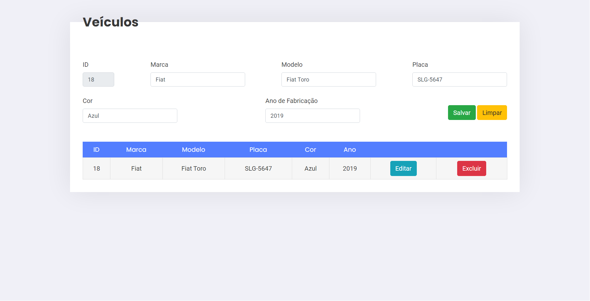

# Auto Escola - DAW 2

Este é um projeto realizado afim de concluir a primeira atividade da disciplina Desenvolvimento de Aplicações Web 2. 

Instituto Federal de Educação Ciência e Tecnologia do Triângulo Mineiro - Campus Patrocínio.

## Atividade 1

Realizar um CRUD para cadastrar carros de uma auto escola. Os dados que devem ser salvos são: marca e modelo do veículo, placa, cor, ano de fabricação. Utilizar os conceitos apresentados na aula.

# Preparando o ambiente

## Dependências

Para iniciar o projeto é necessário ter instalado em sua máquina o [NodeJS](https://nodejs.org/pt-br/).

- Usando **npm**

```bash
$ npm install
$ npm run migrate
```

- Usando **yarn**

```bash
$ yarn install
$ yarn migrate
```

## Iniciando o servidor

- Usando **npm**

```bash
$ npm run dev
```

- Usando **yarn**

```bash
$ yarn dev
```

O servidor será iniciado http://localhost:3333/ e a porta poderá ser alterada no arquivo .env

# Print do Projeto
